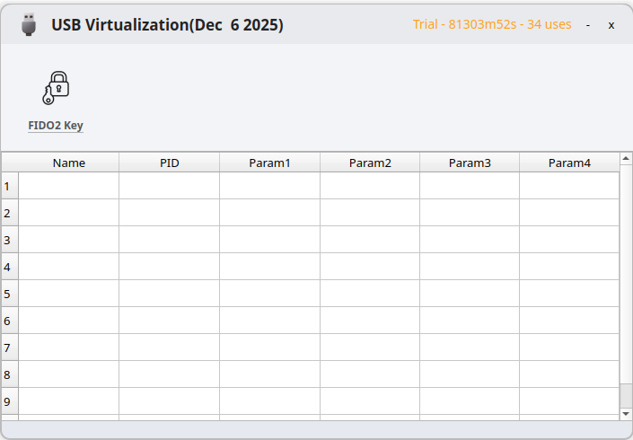

# Virtual FIDO2 For Linux

## Demo Video

## GUI Interface

## Requirements

1. ffmpeg
2. opencv
3. qt 5.15 above
4. ubuntu 24.04

## Installation
1,copy UsbMain and usb-daemon to /usr/local/bin
2,run UsbMain as root
